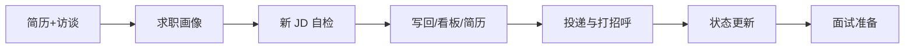

# JD 自检 · Cursor Skill

基于 Cursor 的 JD（岗位描述）自检与投递管理 skill，配合 Obsidian 自检文档与看板使用。通过简历 + 访谈建立求职画像后，可对意向岗位做匹配自检、写回工作考虑、管理投递看板、生成定制简历与 Boss 打招呼语，并支持投递/面试状态更新与面试准备。

## 功能列表

- **首次使用**：简历 + 访谈 → 生成/完善「工作需求-匹配自检」文档（需用户确认后写入）
- **JD 自检**：按自检清单逐条对照，输出匹配结论与是否建议投递
- **写回工作考虑**：将自检结论写入指定工作考虑文档
- **投递看板**：添加岗位到看板、更新已投递/面试中状态
- **定制简历**：按 JD 调整个人优势与强调点，生成岗位定制简历
- **PDF 导出**：简历转 HTML 后通过 Chrome Headless 或浏览器打印导出 PDF
- **Boss 直聘打招呼语**：100～200 字，突出与 JD 匹配点
- **面试准备**：获得面试邀请后可生成岗位要求回顾、匹配点、可能问题与回答要点

## 前置条件

- **Cursor**（本 skill 运行环境）
- **Obsidian**（可选，用于看板与工作考虑文档；也可用普通 Markdown 文件）。**若要在 Obsidian 里以看板视图展示「岗位投递看板」**，需在 Obsidian 中另行安装 **Kanban 插件**（如社区插件「Kanban」）；本 skill 只读写看板 .md 文件内容，不依赖该插件，用普通 Markdown 也可维护看板。
- **Chrome**（推荐，用于一键导出简历 PDF；无则可用浏览器手动打印）

## 安装与配置

**作为 Cursor 插件安装**（推荐）：在 Cursor 内打开 Marketplace（设置或插件面板），搜索「apply-smart」或「JD 自检」安装。若尚未上架，可先通过 [cursor.com/marketplace/publish](https://cursor.com/marketplace/publish) 提交本仓库链接等待审核。

**或 clone 使用**：将本仓库 clone 到你的工作区：
   ```bash
   git clone https://github.com/Lufi000/jd-self-check "<你的工作区路径>/.cursor/skills/jd-self-check"
   ```
2. 按 [CONFIG.md](docs/CONFIG.md) 说明，将 SKILL.md 中出现的**自检文档路径、简历模板路径、看板路径、工作考虑文档命名约定**改为你本地的路径。
3. 首次使用前，准备一份「工作需求-匹配自检」文档（可使用 `templates/工作需求-匹配自检-模板.md` 作为结构参考），或直接通过场景零由 Agent 访谈生成。
4. 自备简历模板（Markdown，见 CONFIG 中的「自备简历要求」）；仓库中不包含任何简历文件。

**建议一人一套工作区或配置**；多人使用请各自 clone 或使用独立工作区。

## 完整使用流程（用户视角）



1. **首次使用 / 初始化**  
   提供**简历**（粘贴或路径）+ 通过**访谈**与 Agent 对话，说明求职方向与偏好。问完后 Agent 会呈现画像摘要并**请你确认**，确认后再自动生成或完善「工作需求-匹配自检」文档。未完成此步无法做 JD 自检。

2. **新 JD 自检**  
   粘贴 JD 或给出工作考虑文档路径 → 自检 → 按需写回工作考虑、加看板、生成定制简历与 PDF、打招呼语。

3. **投递后**  
   告知「已投递 XX」→ 看板移至已投递。

4. **收到面试**  
   告知「XX 约面试」→ 看板移至面试中 → 可选面试准备。

详见 [USAGE.md](docs/USAGE.md)。

## 触发话术

| 场景 | 示例 |
|------|------|
| 建立画像 | 「帮我建立求职画像」「初始化求职自检」、**直接发简历**、或「我想找工作」「准备找工作」 |
| 新 JD 自检 | 「对这份 JD 做自检」「这是新的意向岗位」+ 粘贴 JD 或给工作考虑文档路径 |
| 投递准备 | 「我想投递 XX」「准备投 XX」 |
| 已投递 | 「我已经投递了 XX」「XX 已投递」 |
| 面试邀请 | 「XX 约面试了」「收到 XX 的面试邀请」 |

## 后续更新与历史版本

- **获取更新**：在本地 skill 目录执行 `git pull`。若你改过 SKILL 内路径，pull 可能冲突，建议把个人路径记在 CONFIG 或本地备忘，冲突时手动恢复。
- **历史版本**：所有提交保留在 GitHub。可在仓库「Commits」中查看，或使用 `git checkout <commit>` 恢复某版本；建议维护者对重要版本打 tag（如 v1.0），在 Releases 中按版本号找回。

## License

见仓库说明。
